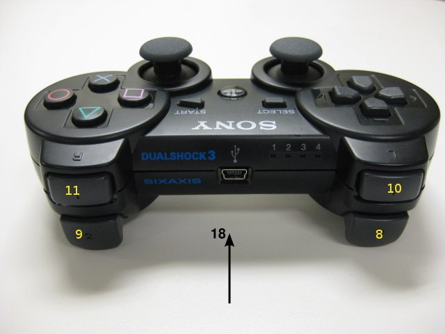

Oculus-Rift Gazebo Navigator
=======================
<p align="middle">
    <a href="http://www.youtube.com/watch?feature=player_embedded&v=69O5Ya9Zrpk
    " target="_blank"></a>
</p>

One of the highlights of the [Gazebo 4.0.0](http://gazebosim.org/blog/gazebo4) release is the added support for the trending VR platform: Oculus-Rift. This navigator is a simple tool that exploits the capabilities of the simulation environment's physics-engine to provide you with the ultimate virtual-reality experience in Gazebo. So simulation will no longer be just a part of development, but instead act as a new medium to demostrate your product to clients in its work environment (in the glory of full-scale).

## Dependencies & Prerequisites
**Core**: [ROS Hydro](http://wiki.ros.org/hydro), [Catkin](http://wiki.ros.org/catkin): see [package.xml](package.xml)

**Custom Requirements:** [Gazebo 4.0.0](https://bitbucket.org/TihomRis/gazebo), [oculussdk](https://github.com/MohitShridhar/oculussdk)

**Other Requirements:** [ps3joy](http://wiki.ros.org/ps3joy) (Ubuntu) or [osx_joystick](https://github.com/walchko/osx_joystick) (OSX)

## Installation & Setup

See the [wiki](https://github.com/MohitShridhar/oculus_gazebo_navigator/wiki/1.-Installation-&-Setup) for more details.

## Controls

### PS3 Controller

Spawn Navigator (Empty world):
```bash
$ roslaunch oculus_gazebo_navigator example_oculus_ps3.launch
```

<p align="center">
    
    
</p>

Credit: [Jonathan Bohren](http://wiki.ros.org/ps3joy)

- **Select Button**: robot mode control

	default - toggle autonomous navigation mode  
	a. Hold L2 - toggle isolated-bot control mode  
    b. Hold R2 - toggle mirror-bot mode (playback rosbag data)  
    
1. **Left Joystick**: virtual-camera maneuver
	
    *Normal-bot control:*  
	default - walking speed  
	a. Hold L2 - running speed  
    
    *Isolated-bot control:*  
    default - normal speed (x, y bot maneuver)  
    b. Hold L2 - high speed (x, y bot maneuver)  
    
2. **Right Joystick**: robot-teleop
	
    *Normal-bot control:*  
    default - normal speed (x, y bot maneuver)  
    a. Hold R2 - normal speed rotation (yaw bot maneuver)  
    b. Hold L2 - high speed (x, y bot maneuver)  
    c. Hold R2 & L2 - high speed rotation (yaw bot maneuver)  
    
    *Isolated-bot control:*  
	default - normal speed rotation (yaw bot maneuver)  
    a. Hold L2 - high speed rotation (yaw bot maneuver)  

3. **Start Button**:
	
    *All bot-control modes:*  
    default – reset robot to spawn position  
    
    *Mirror-bot control:*  
    Hold L2 & R2 - calibrate robot's origin frame offset  
    
4. **Up Button**: customizable request 1

5. **Right Button**: customizable request 2

6. **Down Button**: customizable request 3

7. **Left Button**: customizable request 4

8. **Cross Button**: toggle "X-ray vision" mode

9. **Triangle Button**: toggle "IronMan" mode

    default - toggle gravity  
    a. R1 - up booster  
    b. L1 - down booster  

10. **Square Button**: toggle "Phasing" mode

### Keyboard Op
Although you can control the virtual-camera using your keyboard, it's recommended that you use a PS3 controller for a more immersive experience. Also see [issue #2](/../../issues/2).

To start the controller:
```bash
$ rosrun oculus_gazebo_navigator oculus_keyboard_controller
```
Instructions:
```
'w' forward, 's' back, 'a' left, 'd' right
'z' rotate leftwards, 'c' rotate rightwards
To run, hold 'shift' first and then press the corresponding buttons
'Q' to quit (i.e. Shift + 'q')
```